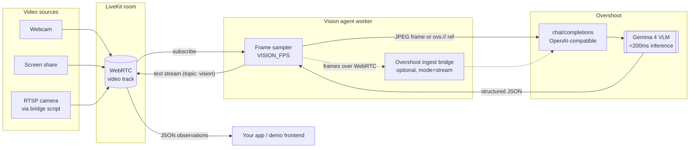

<a href="https://overshoot.ai">
  
</a>

# Real-time vision agent with LiveKit and Overshoot

<p>
  <a href="https://docs.overshoot.ai/integrations/livekit"><strong>Integration guide</strong></a>
  •
  <a href="https://docs.overshoot.ai">Overshoot Docs</a>
  •
  <a href="https://platform.overshoot.ai">Get an API key</a>
  •
  <a href="https://docs.overshoot.ai/models">Models</a>
  •
  <a href="https://docs.livekit.io/agents/">LiveKit Agents</a>
</p>

A [LiveKit Agents](https://docs.livekit.io/agents/) worker that joins a room, watches whatever video gets published there (webcam, screen share, or an RTSP camera), and posts what it sees back into the room as JSON. Inference runs on [Overshoot](https://overshoot.ai), which serves open-weight vision-language models like Gemma 4 behind an OpenAI-compatible API, fast enough that a single look at the video usually comes back in a couple hundred milliseconds.

Every observation lands on a `vision` text stream that any LiveKit client can subscribe to:
 
```json
{
  "summary": "A person is standing at a desk holding a coffee mug",
  "objects": ["person", "desk", "laptop", "coffee mug", "window"],
  "activity": "working at a standing desk",
  "alert": null,
  "_overshoot": { "model": "google/gemma-4-26B-A4B-it", "latency_ms": 187 }
}
```

Reasonable starting point for camera monitoring, screen-watching copilots, or anything else where an app needs a model's read on live video without waiting seconds for it.

## What's in here

- `src/agent.py`: the worker. Subscribes to the first video track in the room, samples it at `VISION_FPS`, sends your `VISION_PROMPT` plus the latest frame to the model, and publishes each JSON result.
- `frontend/`: a single-page demo that publishes your camera or screen and prints the JSON stream with per-request latency. See [examples/camera](examples/camera) and [examples/screen-share](examples/screen-share).
- `examples/rtsp/`: a bridge for IP cameras and NVRs. LiveKit Ingress can't pull RTSP, so this decodes the feed locally with PyAV and publishes it as a normal track.
- `Dockerfile`, `render.yaml`, and a `taskfile.yaml`, so it deploys most places and bootstraps with `lk app create`.

## Architecture



By default each request carries the latest frame as an inline JPEG, which keeps the moving parts to a minimum. Set `OVERSHOOT_INGEST_MODE=stream` and the agent instead republishes the room's video into an Overshoot ingest stream over WebRTC, then references it as `ovs://streams/{id}?frame_index=-1`. In that mode requests carry no pixels at all; it's the same path Overshoot's own ingest uses and has the lowest per-request overhead.

Results go out as a [text stream](https://docs.livekit.io/home/client/data/text-streams/) on the `vision` topic, so consuming them from web, mobile, or another agent is a one-line handler.

## Running it

You need [uv](https://docs.astral.sh/uv/), a [LiveKit Cloud](https://cloud.livekit.io) project (or self-hosted LiveKit), and an [Overshoot API key](https://platform.overshoot.ai).

With the [LiveKit CLI](https://docs.livekit.io/cloud/home/cli):

```bash
lk app create --template-url https://github.com/Overshoot-ai/livekit-vision-agent my-vision-agent
```

or by hand:

```bash
git clone https://github.com/Overshoot-ai/livekit-vision-agent.git
cd livekit-vision-agent
cp .env.example .env.local   # fill in LIVEKIT_* and OVERSHOOT_API_KEY
uv sync
```

Then, in two terminals:

```bash
uv run src/agent.py dev
task frontend                # http://localhost:8080
```

Open the page, click **Share camera** or **Share screen**, and watch the JSON come back. For an RTSP source, see [examples/rtsp](examples/rtsp).

## Structured output

The default schema has `summary`, `objects`, `activity`, and `alert` fields. To get a different shape, put a JSON schema in `VISION_SCHEMA` and the agent holds the model to it:

```bash
VISION_PROMPT=Count the people and describe what each is doing.
VISION_SCHEMA={"type":"object","properties":{"people_count":{"type":"integer"},"actions":{"type":"array","items":{"type":"string"}}},"required":["people_count","actions"]}
```

Each message also carries `_overshoot.latency_ms` (wall-clock time of the inference request), which is handy for figuring out what `VISION_FPS` your setup can actually sustain.

## Deploying

One-click on Render:

[](https://render.com/deploy?repo=https://github.com/Overshoot-ai/livekit-vision-agent)

LiveKit Cloud:

```bash
lk agent create
lk agent deploy
```

Or anywhere that runs Docker:

```bash
docker build -t vision-agent .
docker run --env-file .env.local vision-agent
```

## Configuration

| Variable | Default | Description |
| --- | --- | --- |
| `LIVEKIT_URL` / `LIVEKIT_API_KEY` / `LIVEKIT_API_SECRET` | (required) | Your LiveKit project credentials |
| `OVERSHOOT_API_KEY` | (required) | Overshoot API key ([platform.overshoot.ai](https://platform.overshoot.ai)) |
| `OVERSHOOT_MODEL` | `google/gemma-4-26B-A4B-it` | Any VLM from [the model catalog](https://docs.overshoot.ai/models) |
| `OVERSHOOT_INGEST_MODE` | `frames` | `frames` (inline JPEG) or `stream` (WebRTC ingest + `ovs://` refs) |
| `VISION_FPS` | `2` | Analyses per second |
| `VISION_PROMPT` | describe the scene | What to look for, in plain English |
| `VISION_SCHEMA` | see above | JSON schema for the structured output |

## More docs

- [Overshoot + LiveKit integration guide](https://docs.overshoot.ai/integrations/livekit)
- The [Overshoot API reference](https://docs.overshoot.ai) covers streams, `ovs://` media URLs, and the model catalog
- [LiveKit Agents docs](https://docs.livekit.io/agents/) and [Intro to LiveKit](https://docs.livekit.io/home/get-started/intro-to-livekit/)

## License

Apache-2.0; see [LICENSE](LICENSE).
