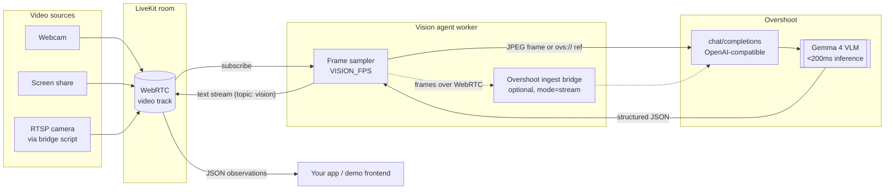

<a href="https://overshoot.ai">
  
</a>

# Real-time vision agent with LiveKit and Overshoot

<p>
  <a href="https://docs.overshoot.ai/integrations/livekit"><strong>Integration guide</strong></a>
  •
  <a href="https://docs.overshoot.ai">Overshoot Docs</a>
  •
  <a href="https://platform.overshoot.ai">Get an API key</a>
  •
  <a href="https://docs.overshoot.ai/models">Models</a>
  •
  <a href="https://docs.livekit.io/agents/">LiveKit Agents</a>
</p>

A production-ready starter for building **real-time video AI**: a [LiveKit Agents](https://docs.livekit.io/agents/) worker that joins a room, watches any live video track (webcam, screen share, or RTSP camera) and streams **structured JSON observations** back to every participant, powered by [Overshoot](https://overshoot.ai)'s sub-200ms vision-language model inference.

Use it as the backbone for live camera monitoring, screen-understanding copilots, sports and gameplay analysis, robotics teleoperation, accessibility narration, or any application where an AI needs to *see* video as it happens, not seconds later.

```json
{
  "summary": "A person is standing at a desk holding a coffee mug",
  "objects": ["person", "desk", "laptop", "coffee mug", "window"],
  "activity": "working at a standing desk",
  "alert": null,
  "_overshoot": { "model": "google/gemma-4-26B-A4B-it", "latency_ms": 187 }
}
```

## Features

- **Real-time VLM inference**: Overshoot serves open-weight vision-language models (Gemma 4, Qwen3.5-VL, and more) through an OpenAI-compatible API engineered to keep time-to-first-token under ~200ms.
- **Three video sources out of the box**: [camera](examples/camera), [screen share](examples/screen-share), and [RTSP cameras](examples/rtsp) (IP cams, NVRs, drones).
- **Structured JSON output**: define what you want as a JSON schema (`VISION_SCHEMA`); every observation is a validated JSON object published on a LiveKit text stream (`vision` topic).
- **Two ingest modes**: inline JPEG frames (zero extra moving parts) or Overshoot's native WebRTC stream ingest, where requests reference `ovs://streams/{id}?frame_index=-1` and carry no pixels at all.
- **Bundled demo frontend**: share your camera or screen and watch the JSON stream live, with per-request latency.
- **Deployable anywhere**: Dockerfile included, one-click deploy to Render, or `lk agent deploy` for LiveKit Cloud.

## Architecture



The agent subscribes to the first video track in the room, samples it at `VISION_FPS`, queries Overshoot with your `VISION_PROMPT` + `VISION_SCHEMA`, and publishes each result to the room as a [text stream](https://docs.livekit.io/home/client/data/text-streams/) on the `vision` topic, so any LiveKit client (web, mobile, another agent) can consume the observations with a one-line handler.

## Quickstart

Prerequisites: [uv](https://docs.astral.sh/uv/), a [LiveKit Cloud](https://cloud.livekit.io) project (or self-hosted LiveKit), and an [Overshoot API key](https://platform.overshoot.ai).

Bootstrap with the [LiveKit CLI](https://docs.livekit.io/cloud/home/cli):

```bash
lk app create --template-url https://github.com/Overshoot-ai/livekit-vision-agent my-vision-agent
```

Or clone manually:

```bash
git clone https://github.com/Overshoot-ai/livekit-vision-agent.git
cd livekit-vision-agent
cp .env.example .env.local   # fill in LIVEKIT_* and OVERSHOOT_API_KEY
uv sync
```

Run the agent and the demo frontend in two terminals:

```bash
uv run src/agent.py dev
task frontend                # → http://localhost:8080
```

Click **Share camera** or **Share screen** and watch structured JSON observations stream in. For an RTSP source, see [examples/rtsp](examples/rtsp).

## Structured JSON output

The default schema reports `summary`, `objects`, `activity`, and `alert`. Swap in your own with `VISION_SCHEMA`, the agent instructs the model to emit exactly that shape in JSON mode:

```bash
VISION_PROMPT=Count the people and describe what each is doing.
VISION_SCHEMA={"type":"object","properties":{"people_count":{"type":"integer"},"actions":{"type":"array","items":{"type":"string"}}},"required":["people_count","actions"]}
```

Each published message also carries `_overshoot.latency_ms`, the wall-clock time of the inference request, so you can see the real-time budget you're working with.

## Configuration

| Variable | Default | Description |
| --- | --- | --- |
| `LIVEKIT_URL` / `LIVEKIT_API_KEY` / `LIVEKIT_API_SECRET` | (required) | Your LiveKit project credentials |
| `OVERSHOOT_API_KEY` | (required) | Overshoot API key ([platform.overshoot.ai](https://platform.overshoot.ai)) |
| `OVERSHOOT_MODEL` | `google/gemma-4-26B-A4B-it` | Any VLM from [the model catalog](https://docs.overshoot.ai/models) |
| `OVERSHOOT_INGEST_MODE` | `frames` | `frames` (inline JPEG) or `stream` (WebRTC ingest + `ovs://` refs) |
| `VISION_FPS` | `2` | Analyses per second |
| `VISION_PROMPT` | describe the scene | What to look for, in plain English |
| `VISION_SCHEMA` | see above | JSON schema for the structured output |

## Deploy

**One-click (Render):**

[](https://render.com/deploy?repo=https://github.com/Overshoot-ai/livekit-vision-agent)

**LiveKit Cloud:**

```bash
lk agent create
lk agent deploy
```

**Anywhere with Docker:**

```bash
docker build -t vision-agent .
docker run --env-file .env.local vision-agent
```

## Learn more

- [Overshoot × LiveKit integration guide](https://docs.overshoot.ai/integrations/livekit)
- [Overshoot API reference](https://docs.overshoot.ai), streams, `ovs://` media URLs, model catalog
- [LiveKit Agents docs](https://docs.livekit.io/agents/) · [Intro to LiveKit](https://docs.livekit.io/home/get-started/intro-to-livekit/)

## License

Apache-2.0; see [LICENSE](LICENSE).
